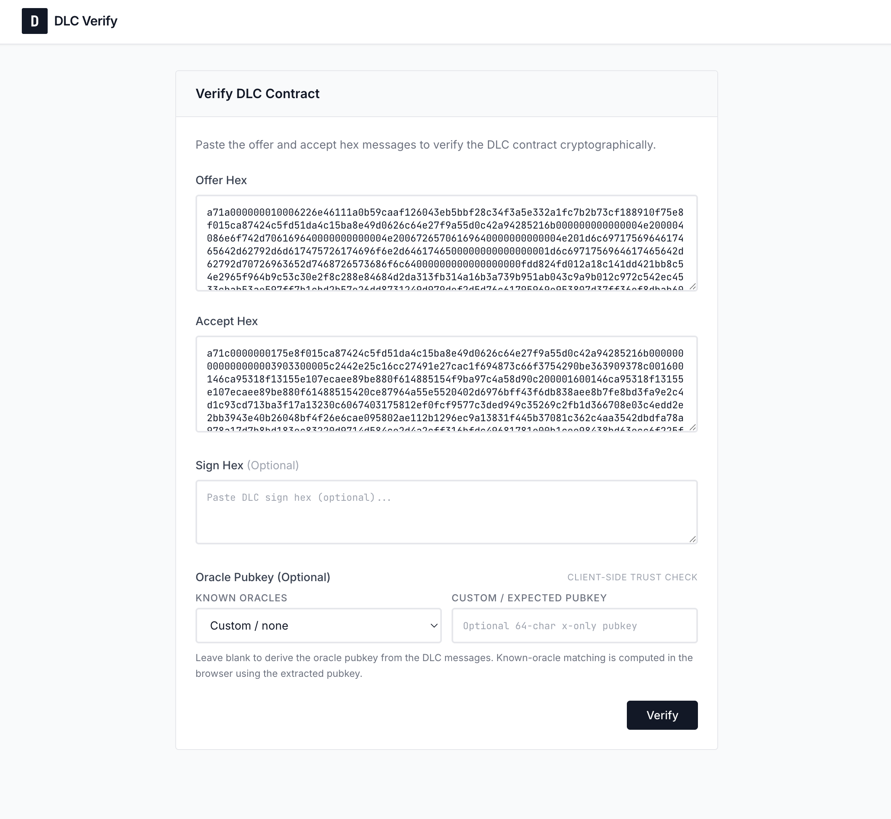
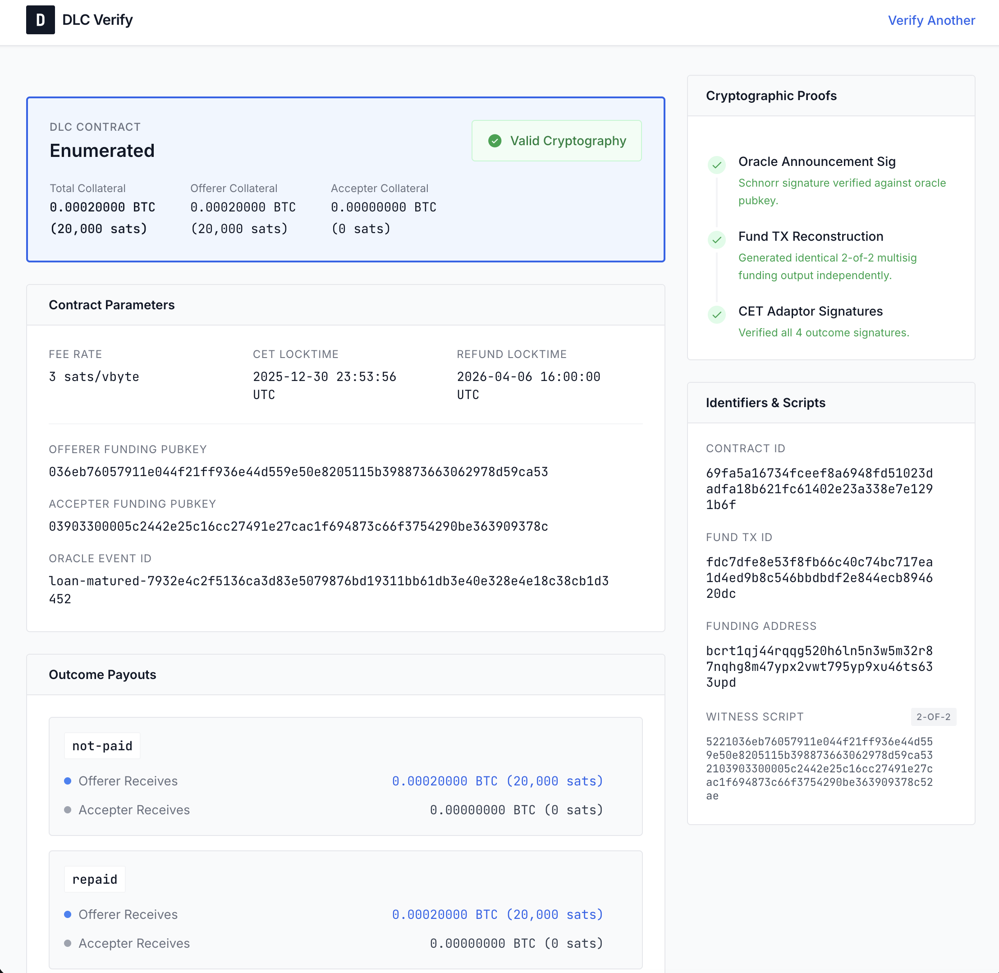
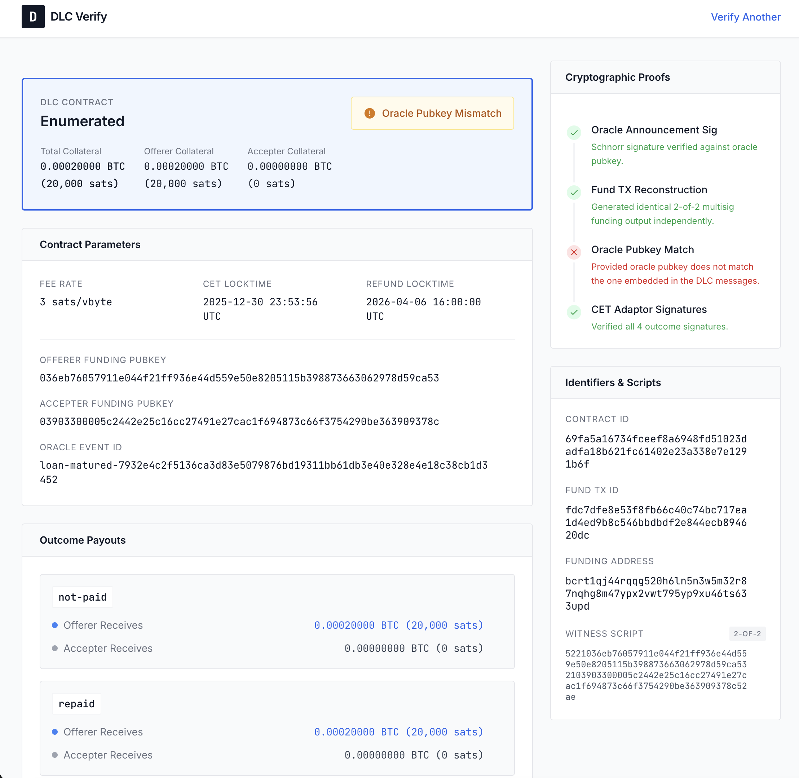

# DLC Verify

An open-source tool for independently verifying DLC (Discreet Log Contract) messages before signing. Paste your `DlcOffer` and `DlcAccept` hex to get a human-readable breakdown of contract terms plus cryptographic verification of the adaptor signatures.

DLC Verify is currently focused on Lygos-style enumerated loan DLCs, but it is designed to be run locally, self-hosted, and reused for similar DLCs that follow the same message and transaction structure.

---

## Screenshots

**Paste your DLC messages:**



**Valid verification result:**



**Oracle pubkey mismatch detected:**



---

## Why this exists

DLC contract messages are opaque binary blobs. If someone sends you a `DlcOffer` or `DlcAccept`, there is usually no easy way to inspect what it actually encodes without specialized tooling. DLC Verify closes that gap.

**This is a "don't trust, verify" tool for enumerated DLC contracts.**

- Inspect payout outcomes and collateral splits before signing
- Verify oracle identity, event IDs, locktimes, and funding data
- Confirm CET adaptor signatures are cryptographically valid
- Run it locally or self-host it without trusting a third-party backend

---

## What it verifies

### Structural verification (message parsing)

- Contract type and collateral amounts
- All outcome payouts (e.g. `repaid`, `liquidated-by-price-threshold`)
- Oracle public key and event ID
- Oracle announcement Schnorr signature validity
- CET maturity and refund locktime
- Fee rate
- Both parties' funding pubkeys and the reconstructed 2-of-2 P2WSH address
- Funding inputs from offerer and accepter
- Contract ID (computed, both RPC and internal-txid conventions)

### Adaptor signature verification (cryptographic)

- Deterministically reconstructs the fund transaction and all CETs from the offer/accept parameters
- Verifies all CET ECDSA adaptor signatures against the oracle's announced nonce and pubkey
- Reports `CRYPTOGRAPHICALLY VALID (N/N)` or `INVALID` with detail

---

## Quick Start

### Prerequisites

- Node.js 18+ required
- pnpm (recommended) or npm

### Install

```bash
pnpm install
pnpm run build  # Compile TypeScript
```

### Run Web UI

```bash
pnpm start
# Open http://localhost:3456
```

### Run CLI

```bash
pnpm run verify              # Use sample data
pnpm run verify -- --help    # Show help
pnpm run verify -- --offer <hex> --accept <hex>
pnpm run verify -- --offer <hex> --accept <hex> --oracle-pubkey <xonly_pubkey>
```

Sample offer/accept hex is stored in `examples/sample.json` for testing.

**Expected output:**

```
DLC Verification Report
=======================

Contract type: Enumerated
Total collateral: 0.00020000 BTC (20000 sats)
...
Adaptor signature verification:
  Fund TX ID: fdc7dfe8...
  CET count: 4
  CET adaptor signatures: CRYPTOGRAPHICALLY VALID (4/4)
```

---

## Dependencies

| Package | Purpose |
|---|---|
| `@node-dlc/messaging` | DLC message deserialization |
| `bitcoinjs-lib` | P2WSH address reconstruction |
| `bitcoin-networks` | Chain hash detection (mainnet/regtest) |
| `bip-schnorr` | Oracle announcement Schnorr sig verification |
| `@bennyblader/ddk-ts` | ECDSA adaptor sig verification via DDK |

`@bennyblader/ddk-ts` is a public MIT-licensed npm package containing pre-compiled native binaries (arm64/x64). It provides the cryptographic transaction reconstruction and adaptor signature verification.

---

## How adaptor signature verification works

The key cryptographic claim being verified: *"The accepter's adaptor signatures are valid ECDSA adaptor signatures, locked to the oracle's announced nonce, that will decrypt to valid CET signatures once the oracle attests to an outcome."*

The verification steps:

1. **Reconstruct the fund transaction** — using the exact parameters from the offer/accept messages, DDK deterministically builds the fund transaction and CET set implied by the DLC.

2. **Build tagged attestation messages** — each outcome string (e.g. `"repaid"`) is hashed as `SHA256(SHA256(tag) || SHA256(tag) || outcome_utf8)` where `tag = "DLC/oracle/attestation/v0"`. This is the DLC spec's oracle attestation message format.

3. **Verify adaptor signatures** — DDK's `verifyCetAdaptorSigsFromOracleInfo` checks that each adaptor signature in `DlcAccept.cetAdaptorSignatures` satisfies the ECDSA adaptor equation:

   ```
   VerifyAdaptor(sig, proof, adaptor_point, cet_sighash, accepter_funding_pubkey)
   ```

   where `adaptor_point = R + H(R, P, msg) * G` (the oracle's anticipated signature point for that outcome).

4. **Report VALID/INVALID** — if all N adaptor signatures pass, the contract is cryptographically sound.

**Why this matters:** A valid adaptor signature means funds can only be claimed by the party who receives the oracle's attestation signature for that specific outcome. The guarantee comes from the cryptography, not from the application that produced the DLC.

---

## Architecture

```
src/
├── verify.ts          # Main verification logic (CLI + library)
├── server.ts          # Express web server
└── types.ts           # TypeScript interfaces

examples/
└── sample.json        # Sample DLC offer/accept hex for testing

public/
└── index.html         # Web UI

Verification layers:
├── Structural: @node-dlc/messaging deserialization
│   ├── DlcOffer.deserialize(hex)
│   ├── DlcAccept.deserialize(hex)
│   ├── Oracle announcement Schnorr sig check (bip-schnorr)
│   └── P2WSH address reconstruction (bitcoinjs-lib)
│
└── Cryptographic: DDK native binary (@bennyblader/ddk-ts)
    ├── createDlcTransactions() → fund TX + CETs
    └── verifyCetAdaptorSigsFromOracleInfo() → true/false
```

No backend. No wallet. No private keys. Stateless.

---

## Security model

- **No private keys handled.** The tool only reads message hex and computes public verification.
- **No server trust required.** You can run the verifier entirely locally or self-host it yourself.
- **Oracle pubkeys are visible in the DlcOffer.** The oracle's identity and nonce commitment are embedded in the offer. You can compare that pubkey against one you obtained independently, or against a known oracle registry in your own deployment.
- **DDK is open source.** The native binary is built from [dlcdevkit](https://github.com/bennyblader/ddk-ffi), source-available under MIT.

---

## Roadmap

- [ ] Accept hex via stdin in addition to CLI args
- [ ] DlcSign verification (fund TX signatures)
- [ ] Refund signature verification
- [ ] Broader DLC shape support beyond the current enumerated focus
- [ ] Oracle pubkey registry / known-oracle presets for hosted deployments
- [ ] Optional hosted instance

---

## License

MIT
